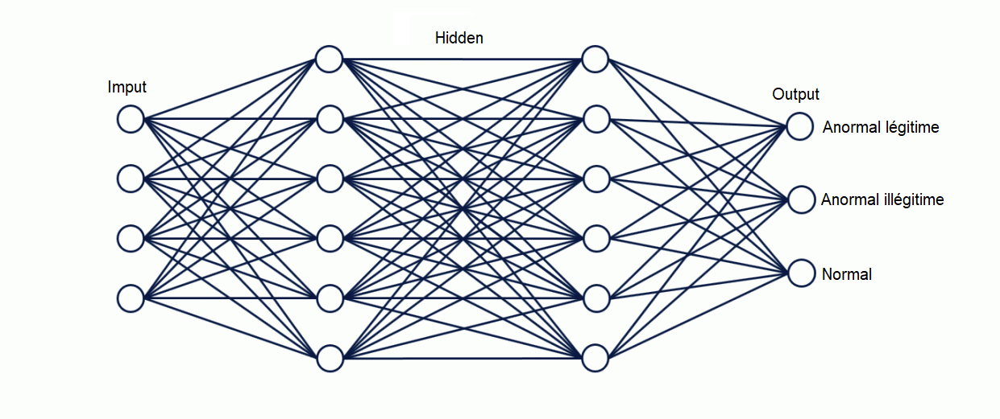
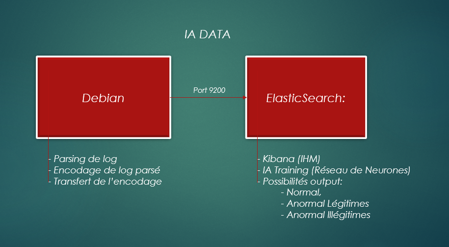

# **DATA-AI Intelligence artificielle pour le traitement de la donnée**

Ce projet consiste en un traitement des différents logs, en générant des données encodées afin qu'une IA décide des activités inhabituelles normales, légitimes et illégitimes.

## **Setup**
### **OS**
*Debian 10*

### **Programmes**
*Elasticsearch*

*kibana*

*Python*

### **Fichiers**

*dpkg.log*

*syslog.log*

*iptables.service*

'<u>' Output exemple:'</u>'  

2020-08-04 21:47:42 startup packages remove

ou

Sep 20 15:42:10 kali systemd[662]: Reached target Sockets.

### **Génération de données et Parsing**

Afin d'avoir un trafic anormalement illégitime, nous avons généré des *nmaps* et des *pings* d'un autre host vers notre machine. Ensuite le script *parsing.ipynb* permet de collecter les logs, de mettre au meme format avec un timestamp similaire.

'<u>' Output exemple:'</u>'  

2020/08/04 21:47:42 startup packages remove

ou

2020/08/20 15:42:10 kali systemd[662]: Reached target Sockets.

### **One Hot Encoder**

Le One Hot Encoding est le processus essentiel de conversion des variables de données à fournir à un algorithme d'apprentissage. 
Supposons que nous ayons une séquence d'étiquettes avec les valeurs « rouge » et « vert ». Nous pouvons attribuer à 'rouge' une valeur entière de 0 et à 'vert' la valeur entière de 1. Tant que nous attribuons toujours ces nombres à ces étiquettes, cela s'appelle un codage entier.

'<u>' Output exemple:'</u>'  

 2020/08/04 21:47:42 0 0 0 0 0 1 0 0 0 0 0 0 0 0 0 1 0 0 0 0 1 0 0 

ou

2020/08/20 15:42:10 0 0 1 0 0 0 0 1 0 0 0 0 0 0 0 1 0 0 0 0 0 0 0

 ### **ElasticSearch**

Pour collecter nos données, nous avons créé un script python nommé "elastickibana.ipynb" qui formate d'abord nos données et les importe dans elasticSearch.


## **Réseau de Neurones**
### **Possibilités output**
```yaml
for i in range(4): #    Nous disons que les 4 premières lignes anormal illégitime.
    Y.append([0, 0, 1])

for i in range(4, 8): #  Nous disons que les 4 premières lignes anormal légitime.
    Y.append([0, 1, 0])

for i in range(8, len(lines)): #  Nous disons que le reste des lignes normal.   
    Y.append([1, 0, 0])
```
Le système détecte donc correctement les 3 états de possibilités, a savoir:
- anormal illégitime
- anormal légitime
- normal 


Réseau:




### **Résumé**




### **Amélioration Possible**

- Meilleure automatisation d'envoi de log entre Debian et Elastic

- Possibilités d'optimiser et de choisir les imputs afin d'avoir un résultat plus fiable